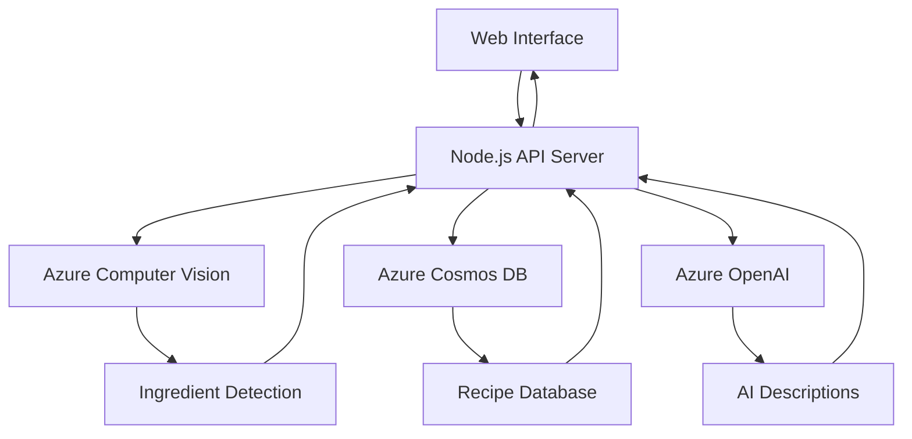

# 🍳 Quick Recipe Recommender

A **multimodal** AI-powered recipe recommender that intelligently suggests recipes based on available ingredients. Built with modern Azure AI services for seamless ingredient detection and personalized recipe recommendations.

---

## 🌟 Key Features

### 🖼️ **Smart Ingredient Detection**
- **Image Analysis**: Upload photos of ingredients and let Azure Computer Vision automatically detect what you have
- **Text Input**: Simply type ingredients in natural language format
- **Multi-modal Processing**: Combines computer vision tags, object detection, and AI-generated captions

### 🤖 **AI-Powered Recommendations**
- **Intelligent Matching**: Advanced algorithms find the best recipes based on your available ingredients
- **Natural Language Descriptions**: Azure OpenAI generates human-friendly, contextual recipe descriptions
- **Personalized Results**: Tailored suggestions based on ingredient combinations

### 📊 **Modern Data Management**
- **Fast Retrieval**: Azure Cosmos DB ensures lightning-quick recipe searches
- **Rich Recipe Data**: Complete recipe information including cook time, difficulty, instructions, and tags
- **Scalable Architecture**: Built to handle growing recipe databases efficiently

---

## 🏗️ System Architecture



**Data Flow:**
1. User uploads image or enters text ingredients
2. Computer Vision API extracts ingredient information
3. Cosmos DB queries matching "easy" recipes
4. OpenAI generates personalized recipe descriptions
5. Results displayed in clean, responsive interface

---

## 🚀 Quick Start

### Prerequisites
- **Node.js** ≥ 16.x
- **npm** or **yarn**
- **Azure Subscription** with the following services:
  - Azure Computer Vision (or AI Foundry)
  - Azure Cosmos DB (Core SQL API)
  - Azure OpenAI Service

### Installation

```bash
# Clone the repository
git clone https://github.com/bensaviofernandez/recipe-bot.git
cd recipe-bot

# Install dependencies
npm install

# Configure environment (see configuration section)
cp .env.example .env
# Edit .env with your Azure credentials

# Start the application
npm start

# Access the application
open http://localhost:3978
```

---

## ⚙️ Configuration

Create a `.env` file in the project root:

```env
# Azure Computer Vision
COMPUTER_VISION_ENDPOINT=https://yourservice.cognitiveservices.azure.com/
COMPUTER_VISION_KEY=your_computer_vision_key

# Azure Cosmos DB
COSMOS_DB_ENDPOINT=https://your-cosmosdb-account.documents.azure.com:443/
COSMOS_DB_KEY=your_cosmos_primary_key
COSMOS_DB_DATABASE=recipebot-db
COSMOS_DB_CONTAINER=recipe-DB

# Azure OpenAI
AZURE_OPENAI_API_KEY=your_openai_api_key
AZURE_OPENAI_ENDPOINT=https://your-openai-resource.openai.azure.com
AZURE_OPENAI_DEPLOYMENT_NAME=gpt-35-turbo

# Application Settings
PORT=3978
NODE_ENV=development
```

### Database Setup

Your Cosmos DB should have the following structure:

```json
{
  "id": "recipe-001",
  "name": "Quick Tomato Pasta",
  "ingredients": ["tomato", "pasta", "garlic", "olive oil"],
  "cook_time": "15 minutes",
  "difficulty": "easy",
  "instructions": ["Boil pasta...", "Heat oil...", "Add tomatoes..."],
  "tags": ["quick", "vegetarian", "italian"]
}
```

---

## 🎯 Usage Guide

### 📸 Image-Based Recipe Discovery

1. **Upload Image**: Use a direct image URL (supports `.jpg`, `.png`, `.gif`)
2. **AI Analysis**: Computer Vision automatically detects ingredients
3. **Smart Recommendations**: Get personalized recipe suggestions
4. **Rich Results**: View recipes with AI-generated descriptions

### ✍️ Text-Based Ingredient Input

1. **List Ingredients**: Enter comma-separated ingredients (e.g., "tomato, garlic, cheese, pasta")
2. **Natural Language**: Use everyday ingredient names
3. **Instant Results**: Get immediate recipe recommendations
4. **Detailed Information**: View complete recipe details and instructions

### 🔍 Results Features

- **Visual Recipe Cards**: Clean, organized recipe presentation
- **Difficulty Indicators**: Easy-to-understand difficulty levels
- **Time Estimates**: Accurate cooking time predictions
- **AI Descriptions**: Context-aware, natural language explanations

---

## 🛠️ Technology Stack

### **Backend Services**
- **Runtime**: Node.js ≥ 16
- **Web Framework**: Restify (lightweight REST API)
- **Environment**: dotenv for configuration management

### **Azure AI & Data Services**
- **Computer Vision**: `@azure/cognitiveservices-computervision` - Ingredient detection
- **OpenAI**: `@azure/openai` - Natural language recipe descriptions  
- **Cosmos DB**: `@azure/cosmos` - Fast, scalable recipe storage
- **AI Model**: GPT-3.5-turbo for chat completions

### **Frontend**
- **Interface**: Vanilla HTML5/CSS3/JavaScript
- **Design**: Responsive, mobile-first approach
- **Performance**: No framework overhead, fast loading

### **Development Tools**
- **AI Assistant**: GitHub Copilot integration
- **Code Quality**: ESLint configuration
- **Deployment**: Azure-ready containerization

---

## 📝 API Endpoints

### `POST /analyze-image`
Analyzes an image URL and returns detected ingredients plus recipe recommendations.

**Request Body:**
```json
{
  "imageUrl": "https://example.com/ingredients.jpg"
}
```

**Response:**
```json
{
  "detectedIngredients": ["tomato", "garlic", "basil"],
  "recipes": [...],
  "descriptions": [...]
}
```

### `POST /get-recipes`
Finds recipes based on text ingredient input.

**Request Body:**
```json
{
  "ingredients": "tomato,garlic,cheese"
}
```

---


## 🆘 Support & Troubleshooting

### Common Issues

**Computer Vision API Errors**
- Verify your endpoint URL and API key
- Ensure your Azure subscription has remaining quota

**Cosmos DB Connection Issues**  
- Check your connection string format
- Verify database and container names exist

**OpenAI API Problems**
- Confirm your deployment name matches your Azure OpenAI resource
- Check API key permissions and quota limits


